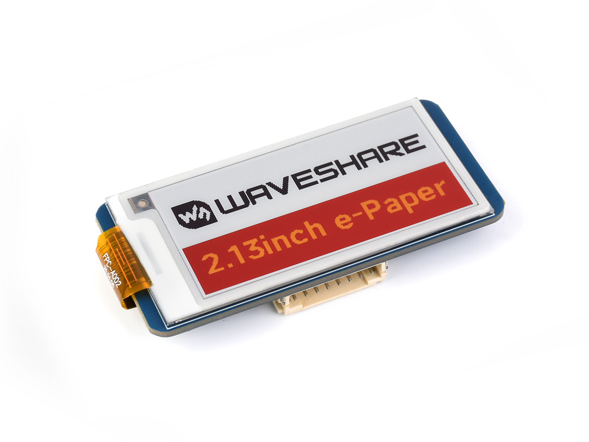
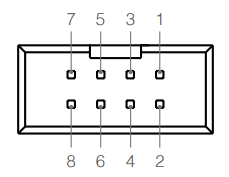
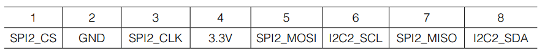
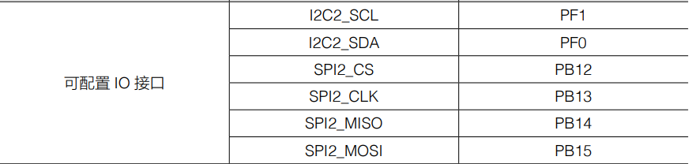
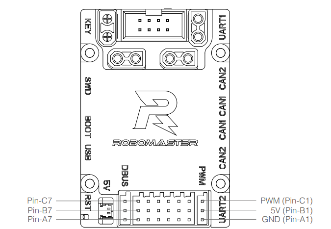
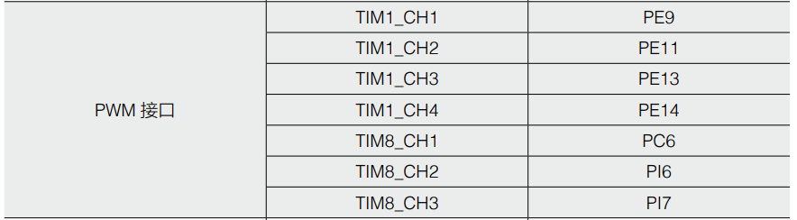
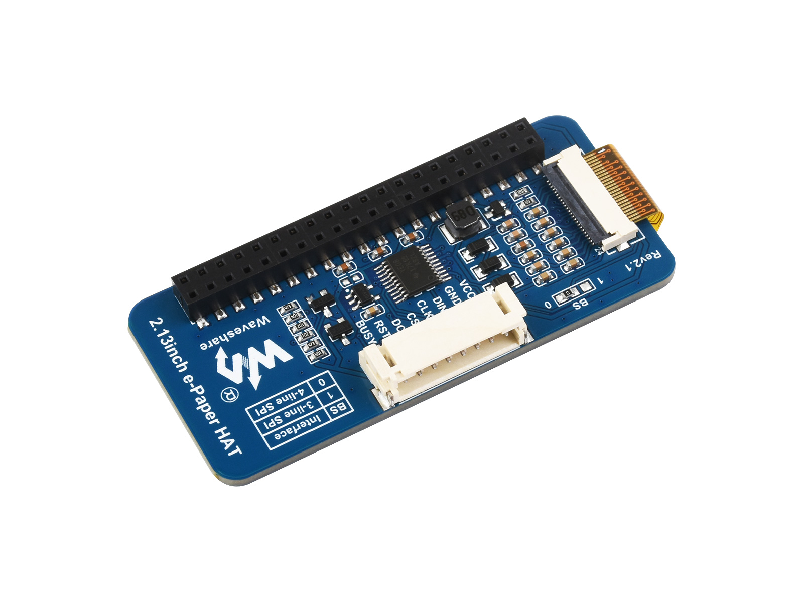

# E-Paper-Development-Board-Type-C
> 微雪电子2.13寸e-Paper红黄黑白四色电子墨水屏驱动demo



## 简介

* 开发工具：Keil V5.38a，VsCode
* 软件环境：Windows11
* 硬件环境：大疆RoboMaster开发板C型(STM32F407IGHX)
* 编译工具：Arm Compiler V5.06u7，C/C++编译 

## 目录结构

```C
E-Paper-Development-Board-Type-C
  ├───Config
  ├───Core
  ├───Drivers
  ├───e-Paper
  ├───Fonts
  ├───GUI
  └───MDK-ARM
```

## 硬件连接

参考[RoboMaster开发板C型用户手册](https://www.robomaster.com/zh-CN/products/components/general/development-board-type-c#downloads)，使用板载**可配置I/O接口**和部分**PWM接口**作为SPI通信所需，线序如下：

* **可配置I/O接口**线序

  

<center>   <div style="color:orange; border-bottom: 1px solid #d9d9d9;    display: inline-block;    color: #999;    padding: 2px;">图1. 可配置I/O口位置图</div> </center>

  

<center>   <div style="color:orange; border-bottom: 1px solid #d9d9d9;    display: inline-block;    color: #999;    padding: 2px;">图2. 可配置I/O口位置和网络名对照表</div> </center>

  

<center>   <div style="color:orange; border-bottom: 1px solid #d9d9d9;    display: inline-block;    color: #999;    padding: 2px;">图3. 可配置I/O口网络名与I/O口对照表</div> </center>

* **PWM接口**线序



<center>   <div style="color:orange; border-bottom: 1px solid #d9d9d9;    display: inline-block;    color: #999;    padding: 2px;">图4. PWM接口位置图</div> </center>



<center>   <div style="color:orange; border-bottom: 1px solid #d9d9d9;    display: inline-block;    color: #999;    padding: 2px;">图5. PWM接口网络名与I/O对照表 </div> </center>

* **墨水屏**线序



使用 8PIN 排线连接，请参考下方的引脚对应表格：

|e-Paper|STM32|
|-|-|
|VCC|3.3V|
|GND|GND|
|DIN|PB15|
|CLK|PB13|
|CS|PB12|
|DC|PE13|
|RST|PE11|
|BUSY|PE14|

<center>   <div style="color:orange; border-bottom: 1px solid #d9d9d9;    display: inline-block;    color: #999;    padding: 2px;">表格1. STM32连接引脚对应关系</div> </center>

## 待完善

源程序取自[微雪电子官网](https://www.waveshare.net/wiki/2.13inch_e-Paper_HAT_(G)_Manual#STM32)，待进一步改进和测试
